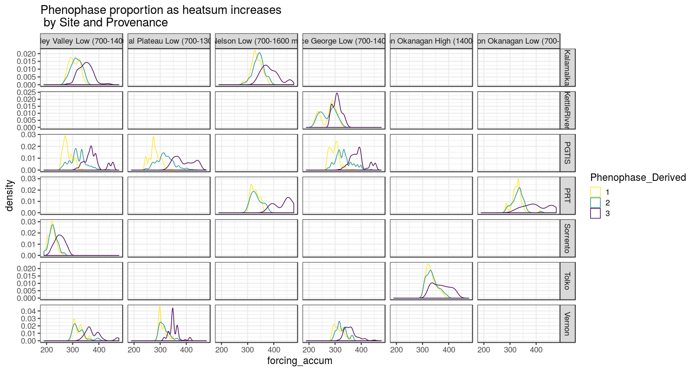
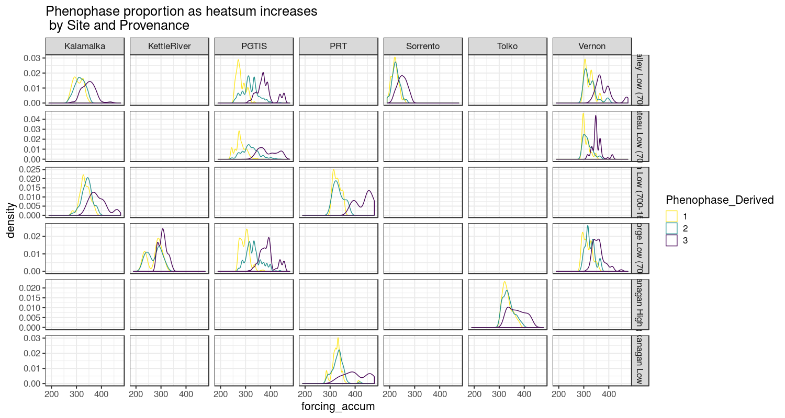

```{r setup, include=FALSE}
library(knitr)
knitr::opts_chunk$set(echo = FALSE, warning = FALSE, message=FALSE)
```

```{r depends}
library(rethinking)
library(bayesplot)
library(tidyverse)

```


## Conceptual Analysis

Pollination phenology in lodgepole pine refers to the timing of two events - pollen shed and cone receptivity. I want to estimate the beginning, end, and length of both events. 

### Phenology data summary

```{r data, echo=FALSE, results="asis"}

forcingtype <- "ristos_scaled"

phenology_data <- read.csv("data/phenology_heatsum.csv", stringsAsFactors = FALSE, header = TRUE) %>%
    filter(forcing_type==forcingtype) 
# phenology_data <- read.csv("../data/phenology_heatsum.csv", stringsAsFactors = FALSE, header = TRUE) %>%
#   dplyr::filter(forcing_type=="ristos")

 SPU_dat <- read.csv("~/Documents/research_phd/data/OrchardInfo/LodgepoleSPUs.csv", header=TRUE, stringsAsFactors = FALSE) %>%
   dplyr::select(SPU_Name, Orchard) #add provenance information
# SPU_dat <- read.csv("~/phd/data/OrchardInfo/LodgepoleSPUs.csv", header=TRUE, stringsAsFactors = FALSE) %>%
# dplyr::select(SPU_Name, Orchard)
 # SPU_dat <- read.csv("~/Documents/phd_sus/data/OrchardInfo/LodgepoleSPUs.csv", header=TRUE, stringsAsFactors = FALSE) %>%
 #   dplyr::select(SPU_Name, Orchard) #add provenance information

phendf <- phenology_data %>%
    na.omit() %>%
  dplyr::left_join(SPU_dat) %>%
    unique()

summary(phendf)

```


```{r data}

ggplot(phendf, aes(x=Sex, y=sum_forcing, fill=as.factor(Phenophase_Derived))) +
    geom_violin() +
    scale_fill_viridis_d() + 
    ggtitle("range of heatsums at each stage")

```


Pollen shed almost always begins prior to or simultaneously with cone receptivity. Pollen shed finishes before the receptive period is over less than half the time and sometimes finishes after the receptivity period is done. 

```{r dataviz, fig.width=11, fig.height=9}
ggplot(phendf, aes(x=sum_forcing, color=as.factor(Phenophase_Derived), linetype=Sex)) +
    stat_ecdf() +
    theme_bw(base_size=16) +
    facet_grid(SPU_Name ~ Site) +
    scale_color_viridis_d(direction =-1) +
    ggtitle("Phenophase accumulation as heatsum increases\n by Site and Provenance") +
    theme(legend.position = "bottom")

```

The order of development and the forcing accumulation required is much more consistent across sites than provenances, suggesting stronger site than provenance effects. The proportion of each phenophase at different forcing amounts is much more consistent within a site than within provenances, suggesting strong site effects/limited provenance effects.

```{r fig.width=11, fig.height=9}
ggplot(phendf, aes(x=sum_forcing, color=as.factor(Phenophase_Derived))) +
    geom_density() +
    theme_bw(base_size=16) +
    facet_grid(Site ~ SPU_Name, scales="free_y") +
    scale_color_viridis_d(direction=-1) +
    ggtitle("Phenophase proportion as heatsum increases\n by Site and Provenance") +
    theme(legend.position = "bottom")

ggplot(phendf, aes(x=sum_forcing, color=as.factor(Phenophase_Derived))) +
    geom_density() +
    theme_bw(base_size=16) +
    facet_grid(SPU_Name ~ Site, scales="free_y") +
    scale_color_viridis_d(direction=-1) +
    ggtitle("Phenophase proportion as heatsum increases\n by Site and Provenance") +
    theme(legend.position = "bottom")
```

<!--
 -->

As the developmental process for pollen shed and cone receptivity appears to be logistic (Sarvas 1972), I will use a logistic model. A logistic model has two parameters. $k$ affects the speed of transition and $h$ determines the time ("location") of transition. $k$ must be positive and between 0 and 1. $k$ near 0 is a slow transition. $k$ near one is a near instantaneous transition. $h$ is the inflection point of the curve, in our case, the point at which a given tree is 50% likely to have transitioned from state $s$ to state $s+1$

$$y = \frac{1}{1+e^{-k(x-h)}}$$

There are two transitions I need to model for each event - 
1) transitioning from not started to active and 
2) from active to completed. 

Since there are two transitions, I will use an ordered logistic model that describes the likelihood of being in each phenological state $s$ given a linear model $\eta$ and cutpoints $c$.

For $S=3$ categories

$$\small{\text{OrderedLogistic}(s|~\eta,c) = \left\{ \begin{array}{ll} 1 -
\text{logistic}(\eta - c_1)  &  \text{if } s = 1, \\[4pt]
\text{logistic}(\eta - c_1) - \text{logistic}(\eta - c_2)  &
\text{if } s=2, \text{and} \\[4pt] \text{logistic}(\eta -
c_3) - 0  &  \text{if } s = 3. \end{array} \right.}
$$
Where $\eta$ is a linear model with explanatory variable x - in our case, forcing units (*e.g.* heatsum), and $k$ slope
$$\eta = k x \\$$
This model is parameterized slightly differently than the logistic model above. In this model 

$$k=k \\
h_s=\frac{c_s}{k}\\$$

An ordered logistic model respects the ordering of the phenological states and generates two curves - one representing the "not-yet to active" transition and the other the "active to complete" transition. The transition from before not-yet to not-yet is not meaningful and $c_1$ is set to 0. THIS IS WRONG AND THE EQUATIONS ARE WRONG DOUBLE CHECK THEM.

Adding intercept components to $\eta$ shifts the location and they are added to the cutpoints when calculating $h_s$. For example, adding a provenance effect to eta 

$$\eta=kx + \alpha_{provenance}$$
means that the location $h_s$ is calculated as

$$h_s = \frac{c_s+\alpha_{provenance}}{k}$$

In this example parameterization, cutpoints are not sex or population specific. $\alpha$ components in $\eta$ affect both transitions equally. So a provenance effect $\alpha_{provenance}$ will shift both the transition from state from 1 to 2 and from 2 to 3 by the same amount. Is this (biologically) correct?

Sarvas's experimental work on development in trees says that 

> the regression of the rate of progress of the active period on temperature is the same for all the genera, species, individual trees and the different parts of the active period investigated in this study. [@Sarvas1972]

His study included *Populus*, *Betula*, *Alnus* as well as *Picea abies*, *Pinus sylvestris*, and 2 *Larix* species.

The unit for the "rate of progress" is period units/hour where period units are 1/5 of the cycle interval that the active period of a given genotype progresses in 1 hour at a constant temperature of 10 degrees C.

So if it takes 100 hours to go from phenophase 1 to 2 at 10 degrees, then the period unit is 20 minutes.

This does not mean that everything should have the same slope ($k$). It does mean that I can use the same forcing units for everything.

I will parameterize this model with effects on k (slopes) from Sex and Provenance and effects on location (intercepts) from Sex, Site, Provenance, Clone, and Year.

### Important model assumptions
In a model where effects are included in eta, any effect influences both curves identically. That is, curves can be shifted to the left or right by an effect, but cannot be shifted in opposite directions.

I am making assumptions about the kinds of effects that are possible in what I choose to include on both slopes and intercepts.

In my current model

####Alternative parameterizations
##### Effects on each cutpoint
I could parameterize the model differently I think. For example, considering just the effects of sex and provenance: 

$$\eta = (k + k_{sex} + k_{provenance})x \\
c_1 = \alpha + \alpha_{sex} + \alpha_{provenance} \\
c_2 = \beta + \beta_{sex} + \beta_{provenance}
$$
This means making way more priors, but I think makes biological sense!  
In old versions of my model, whatever effects there are from provenance, clone, ramet, etc shift all $h_s$ by the same amount. 

This model would have at least double the number of parameters as the other parameterization and may be very difficult or impossible to fit. I did successfully create a model with different effects on both cutpoints, but wasn't able to make the model fit more than one group. This is a technical issue and not a theoretical one. 

##### Difference between cutpoints
Instead of modeling intercepts as part of $\eta$ or on each cutpoint individually, I could model the *difference* between cutpoints. This is my preferred approach, but I cannot make any versions of this with actual effects included work. I've asked for help [here](https://discourse.mc-stan.org/t/add-effects-to-difference-between-cutpoints-in-multilevel-ordered-logistic-model/8421).

I think this makes sense biologically. I'd estimate some main cutpoints and then the effects on the difference would determine the precise location. A positive male effect on the difference would mean that the curves are pushed apart. A negative male effect would mean the curves are pulled closer together. This is still symmetric, but could capture an effect like - males begin flowering at lower forcing units and stop flowering at higher forcing units than females.

### How to include effects of sex, provenance, etc.
The first question is whether to include the effect in the speed of transition $k$ or the locations.

### Male and female in same model?
I am not sure whether to include male and female strobili in the same model. Male and female strobili develop separately but as as part of the same elongating stem. 

If I include them in the same model, unless I do some really crazy parameterization, then I am assuming that clonal, provenance, tree, and site effects are the same across sexes. For example, a clone that has a lower threshold has a lower threshold for both males and females. 

I could do a test for this by running separate models or adding *a lot* of parameters.

The location must vary by sex. If there isn't a cutpoint component  for sex, then curves will be identical for males and females unless the $k$ is allowed to vary. Since $h_s$ depends on $k$ as well as the cutpoints, changes in $k$ can shift the location of the curve. 

Previous model runs have been letting $k$ vary by sex, but not the location. I believe that was a mistake. They could very easily have different $k$ and $h_s$

### Should the sex component have partial pooling?
No! Sex components should not be pooled across males and females. They're connected but separate and I believe they should be allowed to vary completely independently.

### What about pooling for other effects?
For clone, site, year, and provenance, I believe partial pooling is the right decision. No pooling will overfit and exaggerate effects, but ignoring the effects (total pooling) will ignore effects I'm testing for (provenance) or that undoubtedly exist (clone, site).

## So what does the model look like?

$$\begin{array}{rlr}

S_i & \sim \text{OrderedLogistic}(s |\eta_i, c_s)\\
\eta_i & = (k + k_{sex[i]} + k_{provenance[i]}) \times f_i + \alpha_i \\
\alpha_i &= \alpha_{sex[i]} + \alpha_{provenance[i]} + \alpha_{site[i]} + \alpha_{clone[i]} + \alpha_{year[i]} \\


&& \text{priors} \\
c_s &\sim \text{gamma}(7.5,1)
k &\sim \text{beta}(.5,5) & \text{slope priors}\\
k_{sex}, k_{provenance} &\sim \text{normal}(0, 0.1) \\
\alpha_{sex} &\sim \text{normal}(0, \sigma_{sex}) & \text{intercept priors}\\
\alpha_{provenance} &\sim \text{normal}(0, \sigma_{provenance}) \\
\alpha_{site} &\sim \text{normal}(0, \sigma_{site}) \\
\alpha_{clone} &\sim \text{normal}(0, \sigma_{clone}) \\
\alpha_{year} &\sim \text{normal}(0, \sigma_{tree}) \\
\\
&&\text{populations of varying effects} \\
\begin{bmatrix}
\alpha{sex} \\
\beta{sex}
\end{bmatrix} &\sim \text{MVNormal} \\


&& \text{hyperpriors}\\
\sigma_{sex} & \sim \text{exponential}(1.5) \\
\upsilon_{sex} &\sim \text{exponential}(1.5) \\
\\
\sigma_{provenance} &\sim \text{exponential}(1.5) \\
\upsilon_{provenance} &\sim \text{exponential}(1.5) \\
\\
\sigma_{site} &\sim \text{exponential}(1.5) \\
\upsilon_{site} &\sim \text{exponential}(1.5) \\
\\
\sigma_{clone} &\sim \text{exponential}(1.5) \\
\upsilon_{clone} &\sim \text{exponential}(1.5) \\
\\
\sigma_{ramet} &\sim \text{exponential}(1.5) \\
\upsilon_{ramet} &\sim \text{exponential}(1.5)
\end{array}$$


$f$ accumulated forcing units

## What about calculating the start, end, and length of the phenological period?

## Woah now let's calm down and do a simpler version. Maybe look back at an old workflow and try again.


