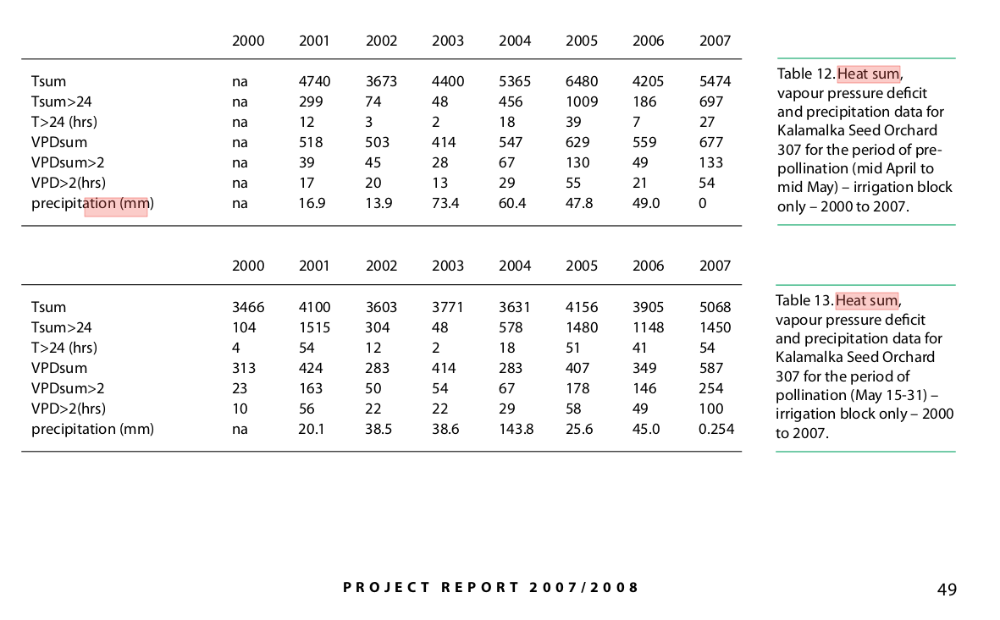

# Compare ristos to heatsum

Owens 2006 reports that heatsums of 500 (threshold 5C) are enough to trigger flowering in lodgepole:

> In lodgepole pine near Vernon,BC, pollen release and seed-cone receptivity began when the DD reached about 500 at a threshold of 5°C, but because pollen release is also governed by humidity, this can vary considerably.

Tongli Wang asks me 

> DD5 of 100 is required for many plants to flush. I am curious how lodgepole pine flowering is related to this. 

Reports by Joe Webber and Chris Walsh report temperature sums as well, but it's unclear how to interpret them. *E.g* this table from a 2008 TIP report:


When is the start date for the heatsum calculation? What's the threshold? Is it daily or hourly? Text makes me think it's just the heating that has accumulated in the month before the pollination period and then during the pollination period. Size makes me think it's hourly sums.

```{r libraries}
library(tidyr)
library(ggplot2)
library(dplyr)
```

So, how do scaled ristos and ristos compare to growing degree days with a threshold of 5°C during the measured lodgepole pine flowering period at all orchards across all years of measurement? And how does it compare to Owens' estimate of 500 degree GDD5 threshold or the numbers Walsh and Webber have?

```{r data}
forcingraw <- read.csv("data/all_clim_PCIC.csv")
    
sumforcingraw <- forcingraw %>%
    select(-mean_temp, -forcing)

phenology <- read.csv("data/phenology_heatsum_all.csv") %>%
    filter(Phenophase_Derived==2)

# df of flowering data with associated forcing
floweringforcing <- select(phenology, DoY, Sex, Year, Site, Date) %>%
    left_join(sumforcingraw) %>%
    distinct()


# wide format for some plots
forcingrawwide <- sumforcingraw %>%
    pivot_wider(names_from = forcing_type, values_from = sum_forcing)

floweringforcingwide <- pivot_wider(floweringforcing, names_from = forcing_type, values_from = sum_forcing)

#group indexes
floweringforcing$grouping <- group_indices(floweringforcing, Sex, Year, Site, forcing_type)
floweringforcingwide$grouping <- group_indices(floweringforcingwide, Sex, Year, Site)

sumforcingraw$grouping <- group_indices(sumforcingraw, Site, Year, forcing_type)
forcingrawwide$grouping <- group_indices(forcingrawwide, Site, Year)
```

First, how do ristos and gdd accumulate throughout the year?

```{r ristos and gdd}

ggplot(sumforcingraw, aes(x=DoY, y=sum_forcing, group=grouping, color=forcing_type)) +
    geom_line(alpha=0.5) +
    scale_color_viridis_d(option="A") +
    ggtitle("Accumulation of forcing units throughout the year", subtitle = "All seed orchard sites, years 1997-2011")
```

Scaled ristos are just ristos/28.4.

```{r conversion}
ggplot(floweringforcingwide, aes(x=scaled_ristos, y=ristos)) +
    geom_point() +
    ggtitle("Convert between scaled ristos and ristos - x28.4")
```

## GDD5 and Ristos accumulated during flowering
On days trees were flowering, the amount of heatsum accumulated in gdd5 is between `r round(min(floweringforcingwide$gdd))` and `r round(max(floweringforcingwide$gdd))`. Ristos? `r round(min(floweringforcingwide$ristos))` and `r round(max(floweringforcingwide$ristos))`. These intervals contain neither the 100 degree rule of thumb threshold Tongli referred to (though it may be more accurate for vegetative flush) nor the 500 degree threshold reported by Owens.

They are in the right ballpark for Walsh and Webber's numbers (once divided by 24 for right units). However, W&W only start adding up heatsum in the month or so before pollination. I think the numbers are still roughly comparable because the 5 degree threshold in GDD5 calculations means that very little accumulates before then.

```{r flowering heatsum}
ggplot(floweringforcingwide, aes(x=ristos, y=gdd, color=Sex)) +
    geom_point(alpha=0.5) +
    ggtitle("GDD5 and Ristos during flowering") +
    facet_wrap("Sex")
```

Importantly, the amount of GDD5 accumulated at a given amount of Risto accummulation within the flowering period is quite variable. 

```{r variance}
fit <- lm(gdd ~ ristos, data = floweringforcingwide)
summary(fit)
```

Because ristos and GDD5 accumulate differently, in each year/location there will be a slightly different relationship between ristos and GDD5.

```{r ristos vs gdd5}
ggplot(filter(forcingrawwide, ristos < 500), aes(x=ristos, y=gdd, group=grouping, color=Site)) +
    geom_line(alpha=0.5)  +
    scale_color_viridis_d(option="B") +
    ggtitle("ristos vs gdd from January 1 thru the flowering period")
```

## Model predictions
My model predicts that flowering will start at around 284 ristos and stop around 426 ristos. In the years/sites I've considered here, 284 ristos is ~140-175 GDD5 and 426 ristos is ~275-320 GDD5.

## Comparison to Walsh and Webber
In the 2007/2008 Tree Improvement Program report, Webber and Walsh recorded the amount of heatsum accumulated in the prepollination period and then in the pollination period at Orchard 307 within an experimental irrigation block. (Beacon Hill Communications Group Inc, Thomas, K., Douglas, D., 2008. Tree Improvement Program Project Report 2007/2008. Forest Genetics Council of British Columbia, Victoria, B.C.)

The prepollination period is recorded as "mid April to mid May" and the period of pollination as May 15-31. No threshold for the calculation or units are provided, nor is the source of the temperature data. I assume it is an hourly rather than daily calculation.

```{r webberwalsh}
ww <- read.csv("data/comparator/webberwalsh_heatsum.csv", stringsAsFactors = FALSE, header = TRUE)
wwday <- ww %>%
    dplyr::mutate(Heatsum_prepollination = Heatsum_prepollination/24) %>%
    dplyr::mutate(Heatsum_pollination = Heatsum_pollination/24) %>%
    dplyr::mutate(Heatsum_total = Heatsum_prepollination + Heatsum_pollination)

kal <- forcingraw %>%
    filter(Site=="Kalamalka" & Year %in% c(2000:2007) & forcing_type=="gdd" & DoY %in% c(106:151)) %>%
    group_by(Year) %>%
    mutate(sum_forcing = cumsum(forcing))

presums <- kal %>%
    group_by(Year) %>%
    filter(DoY < 137) %>%
    summarise(Heatsum_prepollination = sum(forcing))


polsums <- kal %>%
    group_by(Year) %>%
    filter(DoY > 137) %>%
    summarise(Heatsum_pollination = sum(forcing))

may30 <- kal %>%
    group_by(Year) %>%
    summarise(Heatsum_total = sum(forcing))


pcicsums <- data.frame(source = "PCIC", 
                       Year=presums$Year, 
                       Heatsum_prepollination=presums$Heatsum_prepollination, 
                       Heatsum_pollination=polsums$Heatsum_pollination,
                       Heatsum_total=may30$Heatsum_total)

pcicsums <- pivot_longer(pcicsums, cols=starts_with("Heatsum"), names_to = "time", values_to="GDD5")

wwday <- wwday %>%
    mutate(source="ww") %>%
    pivot_longer(cols=starts_with("Heatsum"), names_to = "time", values_to="GDD5")

#Heatsums calculated for between 4/15 and 5/15, 5/15 and 5/30, and 4/14 and 5/30 using PCIC data and also the numbers reported by Walsh and Webber
compframe <- full_join(pcicsums, wwday) %>%
    pivot_wider(names_from = source, values_from = GDD5) 

kalflowering <- floweringforcing %>%
    filter(Year %in% 2000:2007 & Site=="Kalamalka" & forcing_type=="gdd") %>%
    select(DoY, Sex, Year, Site) %>%
    left_join(kal)
    

ggplot(compframe, aes(x=PCIC, y=ww, color=time)) +
    geom_point() +
    geom_abline() +
    ggtitle("Differences between PCIC and Walsh GDD5 calcs")

clong <- full_join(pcicsums, wwday) #same as compframe but long

ggplot(clong, aes(x=Year, y=GDD5, color=source)) +
    geom_point(pch=1) +
    geom_line() +
    geom_point(data=kalflowering, aes(x=Year, y=sum_forcing), inherit.aes = FALSE) +
    facet_grid(time ~ Sex) +
    ggtitle("GDD5 on certain dates and during active pollination period", subtitle = "PCIC and Walsh data, between 4/15 and 5/15, 5/15 and 5/30, and 4/14 and 5/30")

```

```{r variance in ristos v gdd}
floweringforcing$siteyear <- group_indices(floweringforcing, Site, Year)
floweringforcing <- filter(floweringforcing, !forcing_type=="scaled_ristos")

ggplot(floweringforcing, aes(x=as.factor(siteyear), y=sum_forcing, color=forcing_type)) +
    geom_violin() +
    facet_wrap("Sex")

floweringvar <- floweringforcing %>%
    group_by(siteyear, Sex, forcing_type) %>%
    summarise(sd = sd(sum_forcing), mean=mean(sum_forcing))

wfloweringvar <- pivot_wider(floweringvar, names_from = forcing_type, values_from = c(sd, mean))

ggplot(wfloweringvar, aes(x=sd_ristos, y=sd_gdd) ) +
    geom_point() +
    geom_abline() +
    facet_wrap("Sex")

ggplot(wfloweringvar, aes(x=mean_ristos, mean_gdd)) +
    geom_point() +
    geom_abline() +
    facet_wrap("Sex") +
    ggtitle("mean forcing during flowering period")

ggplot(floweringforcing, aes(x=DoY, y=sum_forcing, group=grouping, linetype=forcing_type, color=Site)) +
    geom_line() +
    facet_grid(Sex ~ Year)

ggplot(floweringforcing, aes(x=sum_forcing, color=forcing_type)) +
    geom_density() +
    facet_wrap("Sex")

ggplot(floweringforcingwide, aes(x=ristos, y=gdd)) +
    geom_point()


```
Are gdd5 in those years comparable to gdd calculated at that site and in those years?

April 15 is day 105
May 15 is day 135
May 30 is day 150

Give or take a day for leap years.

```{r}

kalforcing <- forcingraw %>%
    dplyr::filter(Site=="Kalamalka", forcing_type=="gdd", DoY=="")
```

